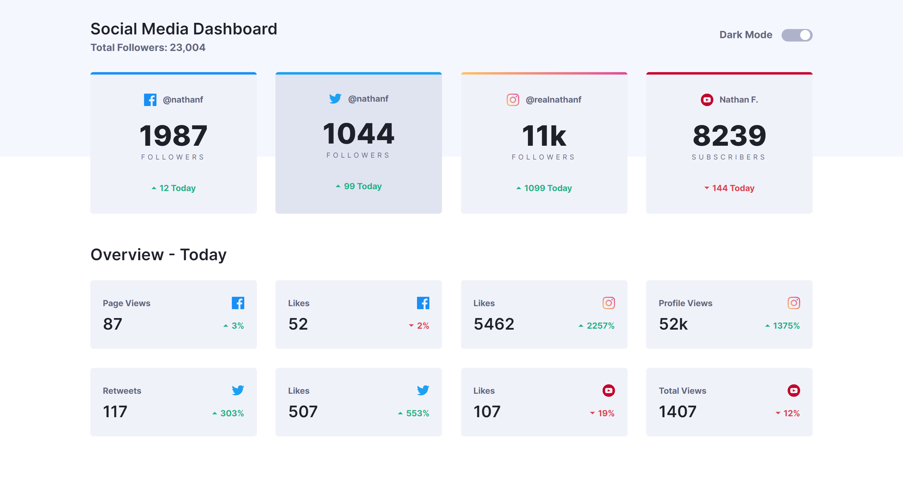
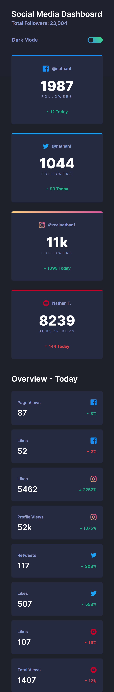

# Frontend Mentor - Social media dashboard with theme switcher solution

This is a solution to the [Social media dashboard with theme switcher challenge on Frontend Mentor](https://www.frontendmentor.io/challenges/social-media-dashboard-with-theme-switcher-6oY8ozp_H). Frontend Mentor challenges help you improve your coding skills by building realistic projects. 

## Table of contents

- [Overview](#overview)
  - [The challenge](#the-challenge)
  - [Screenshot](#screenshot)
  - [Links](#links)
- [My process](#my-process)
  - [Built with](#built-with)
  - [What I learned](#what-i-learned)
  - [Useful resources](#useful-resources)
- [Author](#author)
- [Acknowledgments](#acknowledgments)

## Overview

### The challenge

Users should be able to:

- Toggle color theme to their preference
- View the optimal layout for the interface depending on their device's screen size
- See hover and focus states for all interactive elements on the page

### Screenshot

|Dark Theme|Light Theme|
|-----------|--------------|
|||
|||


### Links

- Solution URL: [Solution on GitHub](https://github.com/mahbubit003/social-media-dashboard-toggle-theme)
- Live Site URL: [Live Website](https://mahbubit003.github.io/social-media-dashboard-toggle-theme/)

## My process

### Built with

- Semantic HTML5 markup
- CSS
- Flexbox
- CSS Grid
- Desktop-first workflow
- JavaScript

### What I learned

I learned many valuable things from this project about front-end development. During the project, I practiced many advanced topics of CSS and JavaScript.
1. CSS Grid
2. Gain deep knowledge in align-items, align-self, and justify-items, justify-self, justify-contents etc. properties
3. Transformation
4. Pointer-events
5. Gap
6. Desktop theme appearance integration with website
7. Learned more about position properties
8. JavaScript: localStorage, changing class name, event listener etc.

### Here are some specific code snippet related to toggle theme

```html
<fieldset class="toggle-mode" aria-label="theme switcher" role="radiogroup">
  <label for="dark">Dark Mode</label>
  <span class="toggle__wrapper" id="toggle__wrapper">
    <input type="radio" value="light" name="theme" id="dark"/>
    <input type="radio" name="theme" id="light" />
    <span aria-hidden="true" class="toggle__background"></span>
    <span aria-hidden="true" class="toggle__switcher"></span>
  </span>
</fieldset>
```

```js
  toggleButton.addEventListener("click", (event) => {
    if (darkTheme.checked == true) {
      document.body.className = "dark";
    } else if (lightTheme.checked == true) {
      document.body.className = "light";
    }

    themeClass = document.body.className;
    localStorage.setItem("mode", themeClass);
  });
```
```css
body.dark{
    background-color: hsl(230, 17%, 14%);
    color: white;

    .top-bg{
    background-color: hsl(232, 19%, 15%);
    }

    .toggle__background{
        background: linear-gradient(225deg, hsl(146, 68%, 55%), hsl(210, 78%, 56%));
    }

    .toggle__switcher{
        background-color: hsl(230, 17%, 14%);
    }
}

body.light
{
    background-color: hsl(0, 0%, 100%);

    .toggle__switcher{
        left: 81%;
        background-color: white;
    }
    
    .toggle__background{
        background: hsl(230, 22%, 74%);
    }
}
```

### Useful resources

- [Youtube Tutorial: freeCodeCamp.org](https://www.youtube.com/watch?v=krfUjg0S2uI) - This helped me to create the full project.
- [CSS Grid Layout](https://developer.mozilla.org/en-US/docs/Web/CSS/CSS_grid_layout)
- [JavaScript: Checked Radio Button](https://www.w3schools.com/jsref/prop_radio_checked.asp)
- [JavaScript: localStorage Property](https://developer.mozilla.org/en-US/docs/Web/API/Window/localStorage)
- [Dark Mode Toggle and prefers-color-scheme](https://dev.to/abbeyperini/dark-mode-toggle-and-prefers-color-scheme-4f3m) and [Setting And Persisting Color Scheme Preferences](https://www.smashingmagazine.com/2024/03/setting-persisting-color-scheme-preferences-css-javascript/)

## Author

- Website - [Md Mahabub Alam](https://github.com/mahbubit003)
- Frontend Mentor - [@mahbubit003](https://www.frontendmentor.io/profile/mahbubit003)


## Acknowledgments

Thank you [freeCodeCamp.org](freecodecamp.org) and the mentor [@JessicaChan](https://coder-coder.com/) for helping us to make projects and to continue practices. 

